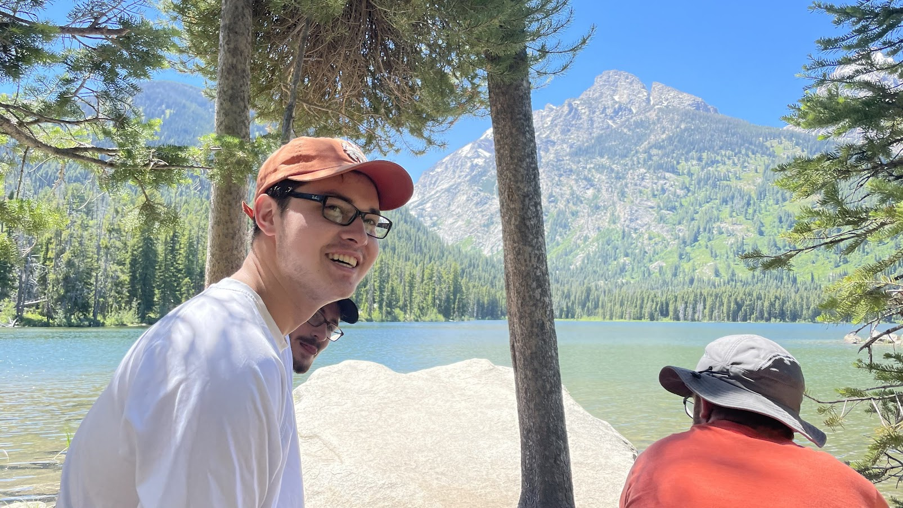

# Hi!

### About me
I'm Eric, currently studying computer science at Georgia Tech! You can reach me here: estuhr1206@gmail.com

Here's what I'm working on right now:
* Doing undergraduate research under professor [Ahmed Saeed](https://saeed.github.io/) in the data center networking space. 
 * First place undergraduate poster at SIGCOMM 23! And I got to meet a ton of great people in NYC from the SIGCOMM community. You can find my poster <a href="sigcomm23_estuhr_asaeed.pdf" target="_blank">here.</a>
* Interned at Verizon Business, in their Global Presales Lab as a solutions architect. Got up close and personal with automating functionality in a datacenter environment, and learned more about networking from a telecom engineering perspective. 

 
My info:
* [Github](https://github.com/estuhr1206)
* [LinkedIn](https://www.linkedin.com/in/eric-stuhr/)
* <a href="Eric_Stuhr_Resume.pdf" target="_blank">Resume</a>

