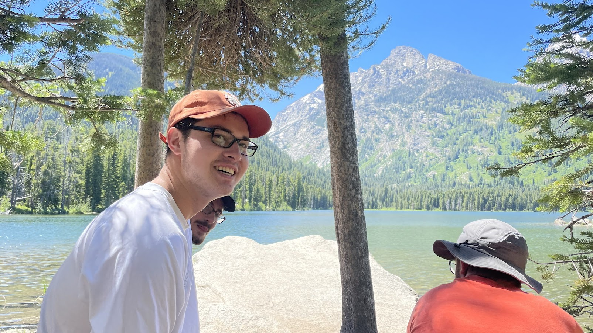

# Eric Stuhr

### About me
I'm Eric, currently working on network operating systems at Juniper. You can reach me here: estuhr1206@gmail.com

### Here's what I'm working on right now:
#### Work:
* Working at Juniper Networks as a software engineer for MX and PTX platforms. Supporting some of the largest network operators in the world on custom hardware and silicon.

#### Internships:
* Summer 2024 interned at Juniper Networks as a software engineering intern in the platforms org, supporting Junos and Evo on embedded systems.
* Summer 2023 interned at Verizon Business, in their Global Presales Lab as a solutions architect. Got up close and personal with automating functionality in a datacenter environment, and learned more about networking from a telecom engineering perspective.
* Summer 2022 interned at Lockheed Martin, working on distributed messaging for an aviation project.

#### School:
* Graduated with my B.S. and M.S. from Georgia Tech, with networking and computing systems specializations
  * Graduate teaching assistant(TA) for Networking 1 in Fall 2024
  * Was the graduate TA for a special topics on [Datacenter Networks and Systems](https://saeed.github.io/CS8803_DNS_Spring2024/index.html){:target="_blank"}
  * TA'd Computer Organization and Architectue, covering digital logic, assembly, and C
* Graduate research under professor [Ahmed Saeed](https://saeed.github.io/){:target="_blank"} in the data center networking space. 
  * First place undergraduate poster at SIGCOMM 23 (ACM)! And I got to meet a ton of great people in NYC from the SIGCOMM community. You can find my poster <a href="sigcomm23_estuhr_asaeed.pdf" target="_blank">here.</a>
  * CoreSync: A Protocol for Joint Core Scheduling and Overload Control of µs-Scale Tasks [ICNP 2025(IEEE)](https://saeed.github.io/files/coresync-icnp25.pdf){:target="_blank"}
  * Modeling the Interactions between Core Allocation and Overload Control in µs-Scale Network Stacks [MASCOTS 2025 (IEEE)](https://saeed.github.io/files/coresync_model-mascots25.pdf){:target="_blank"}

 
### My info:
* [Github](https://github.com/estuhr1206){:target="_blank"}
* [LinkedIn](https://www.linkedin.com/in/eric-stuhr/){:target="_blank"}
* <a href="Eric_Stuhr_Resume.pdf" target="_blank">Resume</a>

